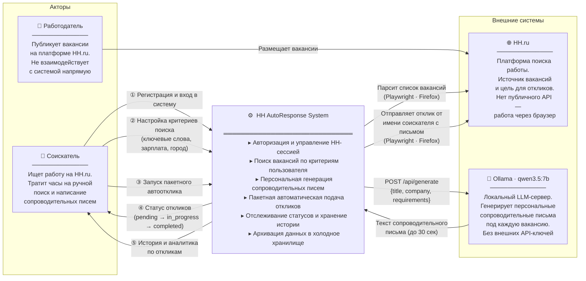

# Уровень 1 — Бизнес-контекст (Business Context)

> Система как «чёрный ящик». Показывает внешних акторов, их роли и бизнес-процессы,
> которые система автоматизирует. Внутренняя архитектура скрыта.

## Бизнес-процессы, которые автоматизирует система

| № | Было (ручной процесс) | Стало (автоматизировано) |
|---|---|---|
| 1 | Ежедневный ручной поиск вакансий (1–2 ч/день) | Автоматический парсинг по расписанию |
| 2 | Написание уникального письма для каждой вакансии | Генерация через LLM за ~20 сек |
| 3 | Ручная подача каждого отклика на сайте | Playwright-автоматизация в фоне |
| 4 | Отсутствие истории откликов | Хранение в PostgreSQL + архив в MinIO |

## Границы ответственности

| Внутри системы | Вне системы |
|---|---|
| Управление JWT-сессией пользователя | Алгоритмы ранжирования вакансий HH.ru |
| Хранение HH-токена (Playwright storageState) | Решение работодателя о приглашении |
| Генерация писем через Ollama | Качество LLM-модели qwen3.5:7b |
| Архивация данных старше 30 дней | Политика HH.ru в отношении автоматизации |
