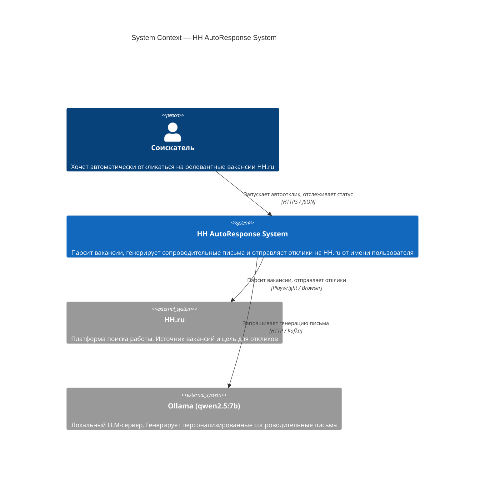

# C4 Level 1 — System Context

Показывает систему целиком и её отношения с внешним миром.

## Ключевые решения

| Аспект | Решение |
|---|---|
| Взаимодействие с HH.ru | Playwright (браузерная автоматизация) — сайт не имеет публичного API |
| Генерация писем | Ollama локально — без внешних API-ключей и платежей |
| Пользователь | Один соискатель = один аккаунт HH.ru; токен хранится зашифрованно |
