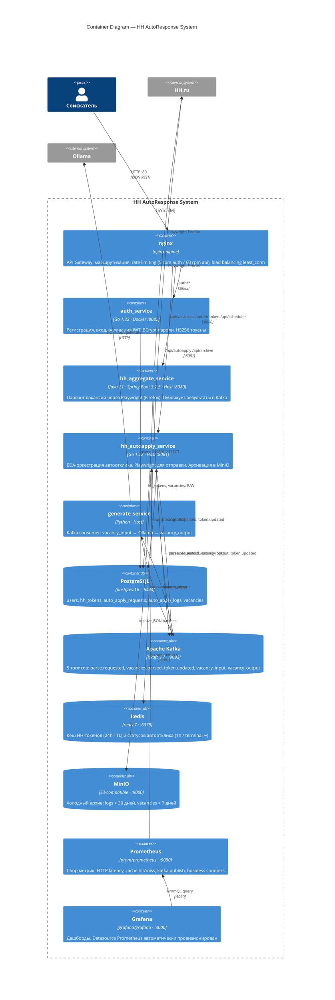

# C4 Level 2 — Container Diagram

Все контейнеры (процессы, хранилища) внутри системы и их связи.

## Запуск

| Контейнер | Команда |
|---|---|
| Infra + Auth + Gateway + Observability | `docker-compose up -d` |
| Java aggregate service | `cd hh_aggregate_service && mvn spring-boot:run` |
| Go autoapply service | `cd hh_autoapply_service && go run cmd/main.go` |
| Python generate service | `python generate_service/generate.py` |
