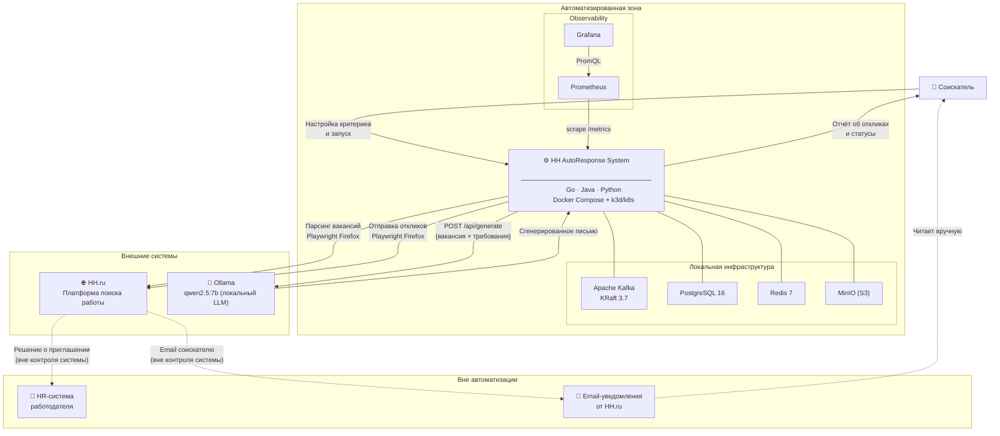

# Уровень 2 — Ландшафт систем (System Landscape)

> Система в контексте IT-ландшафта. Показывает, какие внешние системы окружают
> HH AutoResponse System, как соискатель взаимодействует со всей экосистемой,
> и что остаётся за границами автоматизации.

## Зоны ответственности

| Зона | Что включено | Кто управляет |
|---|---|---|
| Автоматизированная | SYS + Infra + Observability | Команда разработки |
| Внешние системы | HH.ru, Ollama | Третьи стороны |
| Вне автоматизации | HR-системы, Email | HH.ru / Работодатель |

## Ключевые интеграционные точки

| Интеграция | Протокол | Направление | Примечание |
|---|---|---|---|
| HH.ru парсинг | HTTP/Browser (Playwright) | SYS → HH.ru | Нет публичного API |
| HH.ru отклик | HTTP/Browser (Playwright) | SYS → HH.ru | От имени соискателя |
| Ollama генерация | HTTP REST POST /api/generate | SYS → Ollama | Локальный сервер |
| Пользователь | HTTP REST :80 (nginx) | USER ↔ SYS | JWT-аутентификация |
