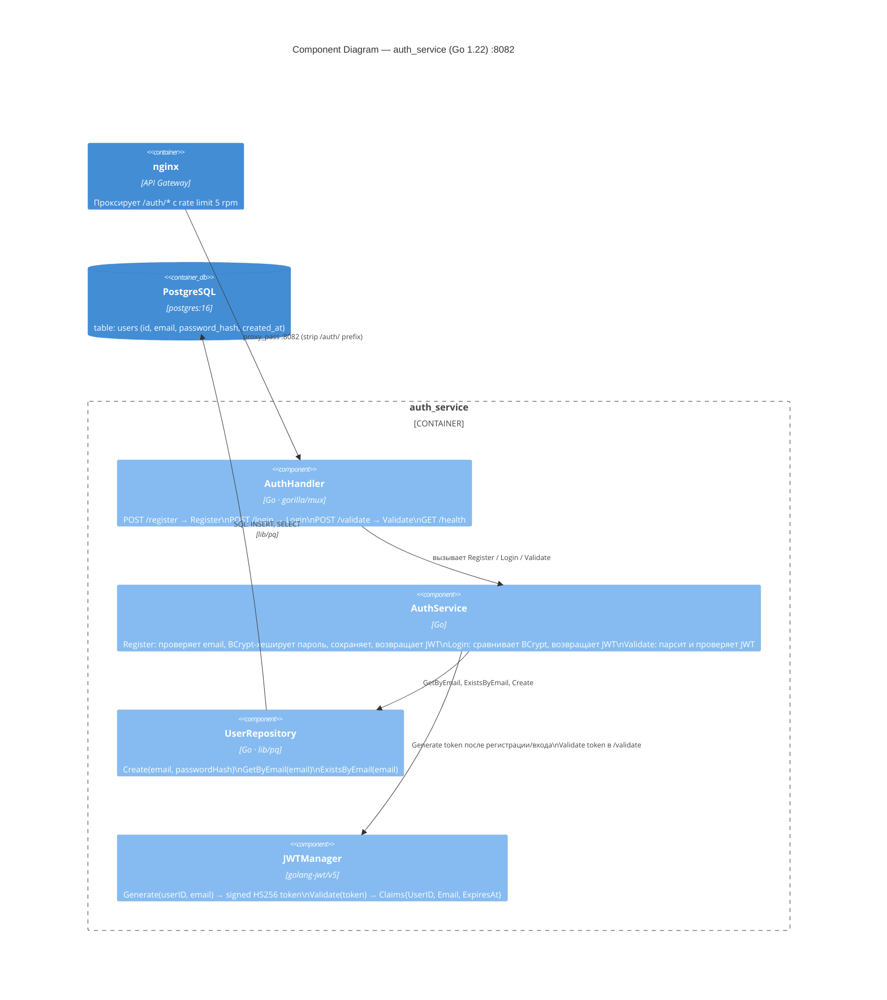

# C4 Level 3 — Component: auth_service

Внутренние компоненты Go сервиса аутентификации.

## Контракт API

| Метод | Путь | Тело | Ответ |
|---|---|---|---|
| POST | `/auth/register` | `{email, password}` | `{token, expires_at}` |
| POST | `/auth/login` | `{email, password}` | `{token, expires_at}` |
| POST | `/auth/validate` | `{token}` | `{valid, user_id, email}` |
| GET | `/auth/health` | — | `{status: "ok"}` |

## Замечания

- JWT secret (`HS256`) совпадает с Java и Go сервисами — принимают токены друг друга
- Дублирует аутентификацию в Java и Go (known issue — не трогаем)
