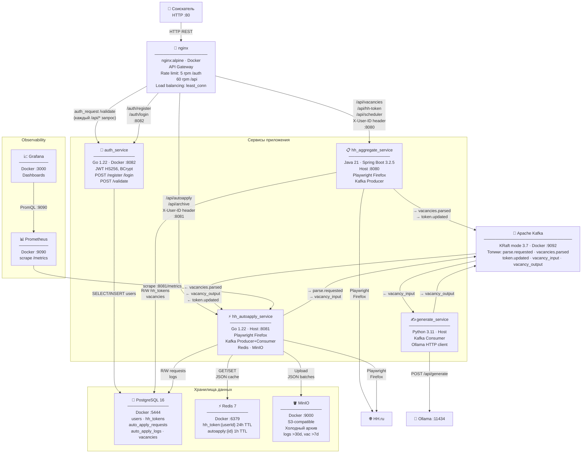

# Уровень 3 — Контейнеры (Containers)

> Все исполняемые единицы системы, хранилища и их коммуникационные протоколы.
> Каждый прямоугольник — отдельный процесс / контейнер с указанием технологии.

## Размещение контейнеров

| Контейнер | Рантайм | Порт | Запуск |
|---|---|---|---|
| nginx | Docker | :80 | `docker-compose up -d nginx` |
| auth_service | Docker | :8082 | `docker-compose up -d auth_service` |
| hh_aggregate_service | Host JVM | :8080 | `mvn spring-boot:run` |
| hh_autoapply_service | Host Go | :8081 | `go run cmd/main.go` |
| generate_service | Host Python | — | `python generate_service/generate.py` |
| PostgreSQL | Docker | :5444 | `docker-compose up -d postgres` |
| Kafka | Docker | :9092 | `docker-compose up -d kafka` |
| Redis | Docker | :6379 | `docker-compose up -d redis` |
| MinIO | Docker | :9000/:9001 | `docker-compose up -d minio` |
| Prometheus | Docker | :9090 | `docker-compose up -d prometheus` |
| Grafana | Docker | :3000 | `docker-compose up -d grafana` |
