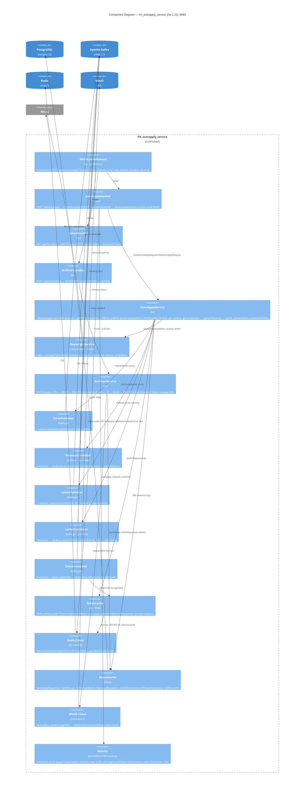

# C4 Level 3 — Component: hh_autoapply_service

Внутренние компоненты Go сервиса автоотклика — наиболее сложного в системе.

```mermaid
C4Component
  title Component Diagram — hh_autoapply_service (Go 1.22) :8081

  ContainerDb(postgres, "PostgreSQL", "postgres:16")
  ContainerDb(kafka, "Apache Kafka", "KRaft 3.7")
  ContainerDb(redis, "Redis", "redis:7")
  ContainerDb(minio, "MinIO", "S3")
  System_Ext(hh_ru, "HH.ru")

  Container_Boundary(svc, "hh_autoapply_service") {

    Component(metrics_mw, "MetricsMiddleware", "Go · gorilla/mux", "Prometheus HTTP metrics на каждый запрос:\nhttp_requests_total, http_request_duration_seconds")

    Component(aa_handler, "AutoApplyHandler", "Go", "POST /api/autoapply → CreateAutoApply\nGET  /api/autoapply/{id} → GetAutoApplyStatus (cache-aside Redis)")
    Component(token_handler, "TokenHandler", "Go", "GET  /api/hh-token → GetHHToken\nPOST /api/hh-token → ExtractHHToken")
    Component(archiver_handler, "ArchiverHandler", "Go", "POST /api/archive/run → RunAll\nGET  /api/archive/list → ListCold")

    Component(aa_svc, "AutoApplyService", "Go", "Оркестрирует весь EDA-флоу:\n1. getHHToken (cache → DB)\n2. publish parse.requested\n3. WaitForJob(2 min)\n4. per vacancy: generateLetter → applyToVacancy → log\n5. updateStatus completed/failed")
    Component(playwright_svc, "PlaywrightService", "playwright-go · Firefox", "Login с storageState\nApplyToVacancy: открыть, заполнить письмо, отправить")
    Component(archiver_svc, "ArchiverService", "Go", "ArchiveLogs (> 30d → MinIO → DELETE)\nArchiveVacancies (> 7d → MinIO → DELETE)\nStartScheduler (ticker каждые 24h)")

    Component(parse_pub, "ParsePublisher", "kafka-go", "→ parse.requested\n{jobId, query, page, userId}")
    Component(vacancy_corr, "VacancyCorrelator", "kafka-go · sync.Map", "Consumer ← vacancies.parsed\nWaitForJob(jobId, 2min) → chan[]Vacancy")
    Component(letter_pub, "LetterPublisher", "kafka-go", "→ vacancy_input\n{correlationId, title, company, requirements}")
    Component(letter_corr, "LetterCorrelator", "kafka-go · sync.Map", "Consumer ← vacancy_output\nWaitForLetter(corrId, 30s) → chan string")
    Component(token_cons, "TokenConsumer", "kafka-go", "Consumer ← token.updated\n→ TokenCache.Set(userId, storageState)")

    Component(token_cache, "TokenCache", "Go · Redis", "Redis primary (24h TTL)\nIn-memory fallback при недоступности Redis\nПережигает рестарт сервиса")
    Component(redis_client, "Redis Client", "go-redis/v9", "Get/Set/GetJSON/SetJSON/Del\nErrCacheMiss для явного cache miss")
    Component(repos, "Repositories", "lib/pq", "AutoApplyRepository: GetOldLogs, DeleteLogsByIDs\nVacancyRepository: GetOldVacancies\nHhTokenRepository: GetByUserID")
    Component(minio_client, "MinIO Client", "minio-go/v7", "Upload(key, data)\nList(prefix) → []ObjectInfo\nensureBucket при старте")
    Component(prom_metrics, "Metrics", "prometheus/client_golang", "promauto регистрация:\nautoapply_requests_total, kafka_messages_published_total,\nredis_cache_hits/misses_total")
  }

  Rel(metrics_mw, aa_handler, "wraps")
  Rel(metrics_mw, token_handler, "wraps")
  Rel(metrics_mw, archiver_handler, "wraps")

  Rel(aa_handler, aa_svc, "CreateAutoApplyRequest\nGetAutoApplyRequest")
  Rel(aa_handler, redis_client, "cache-aside: GET autoapply:{id}")
  Rel(aa_handler, prom_metrics, "autoapply_requests_total.Inc()")

  Rel(aa_svc, token_cache, "getHHToken(userId)")
  Rel(aa_svc, parse_pub, "Publish(jobId, query)")
  Rel(aa_svc, vacancy_corr, "WaitForJob(jobId, 2min)")
  Rel(aa_svc, letter_pub, "Publish(corrId, vacancy)")
  Rel(aa_svc, letter_corr, "WaitForLetter(corrId, 30s)")
  Rel(aa_svc, playwright_svc, "ApplyToVacancy(token, vacancy, letter)")
  Rel(aa_svc, repos, "R/W requests, logs")

  Rel(token_cons, token_cache, "Set(userId, storageState)")
  Rel(token_cache, redis_client, "primary: GET/SET hh_token:{userId}")

  Rel(archiver_handler, archiver_svc, "RunAll / ListCold")
  Rel(archiver_svc, repos, "GetOldLogs, GetOldVacancies, Delete*")
  Rel(archiver_svc, minio_client, "Upload JSON batches")

  Rel(parse_pub, kafka, "→ parse.requested")
  Rel(vacancy_corr, kafka, "← vacancies.parsed")
  Rel(letter_pub, kafka, "→ vacancy_input")
  Rel(letter_corr, kafka, "← vacancy_output")
  Rel(token_cons, kafka, "← token.updated")

  Rel(repos, postgres, "SQL / lib-pq")
  Rel(redis_client, redis, "TCP")
  Rel(minio_client, minio, "S3 API :9000")
  Rel(playwright_svc, hh_ru, "Browser automation")
```
