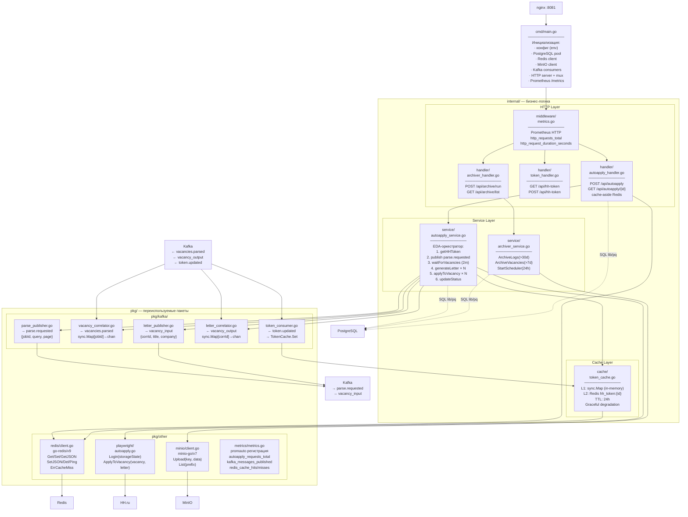

# Уровень 4 — Подконтейнеры (Subcontainers)

> Внутренние модули наиболее сложного контейнера — **hh_autoapply_service**.
> Каждый модуль — отдельный Go-пакет со своей зоной ответственности.

## Модульная структура пакетов

| Пакет | Ответственность | Внешние зависимости |
|---|---|---|
| `cmd/` | Точка входа, инициализация DI | все пакеты |
| `internal/middleware/` | HTTP-метрики Prometheus | `pkg/metrics` |
| `internal/handler/` | HTTP-хендлеры, routing | `internal/service`, `pkg/redis` |
| `internal/service/` | Бизнес-логика EDA | `pkg/kafka`, `pkg/playwright`, `internal/cache` |
| `internal/cache/` | Двухуровневый кеш токенов | `pkg/redis` |
| `pkg/kafka/` | Kafka producer/consumer + корреляция | `kafka-go` |
| `pkg/redis/` | Redis CRUD обёртка | `go-redis/v9` |
| `pkg/playwright/` | Playwright автоматизация HH.ru | `playwright-go` |
| `pkg/minio/` | MinIO S3 upload/list | `minio-go/v7` |
| `pkg/metrics/` | Prometheus метрики (promauto) | `prometheus/client_golang` |
