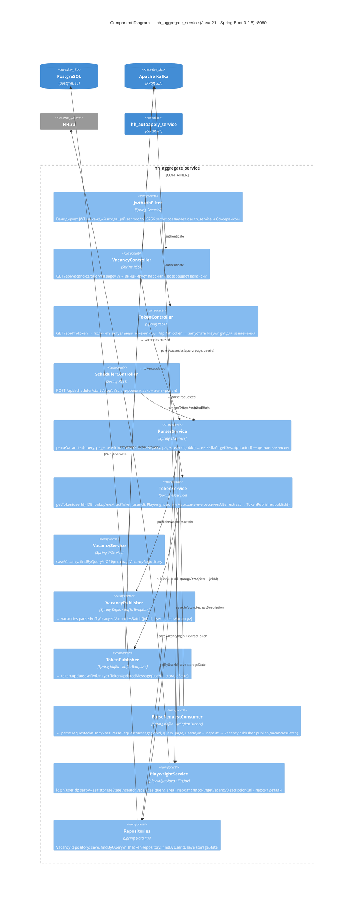

# C4 Level 3 — Component: hh_aggregate_service

Внутренние компоненты Java/Spring Boot сервиса агрегации вакансий.

## Kafka-топики (продюсер)

| Топик | Сообщение | Когда |
|---|---|---|
| `vacancies.parsed` | `VacanciesBatch{jobId, userId, List<Vacancy>}` | После каждого парсинга |
| `token.updated` | `TokenUpdatedMessage{userId, storageState}` | После `extractToken` |

## Kafka-топики (консьюмер)

| Топик | Триггер |
|---|---|
| `parse.requested` | Go публикует при `POST /api/autoapply` → Java парсит и возвращает |
