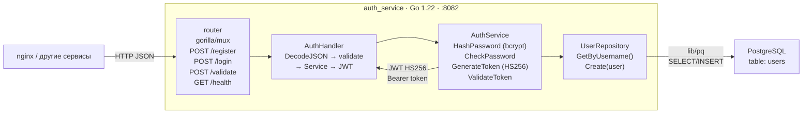
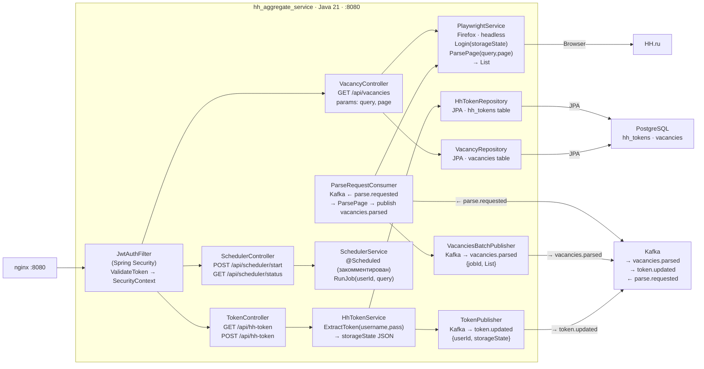
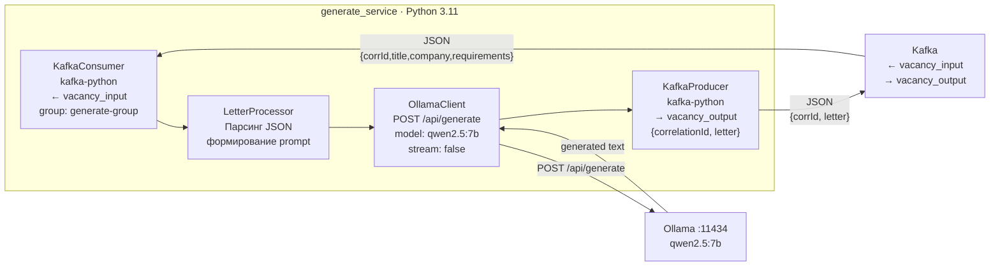
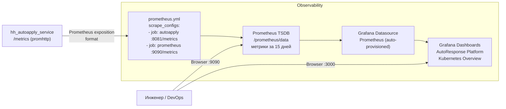

# Уровень 5 — Компоненты (Components)

> Группы классов и функций внутри каждого сервиса.
> Диаграммы разбиты по сервисам для читаемости.

## 5.1 auth_service (Go)

## 5.2 hh_aggregate_service (Java / Spring Boot)

## 5.3 generate_service (Python)

## 5.4 Observability Stack

