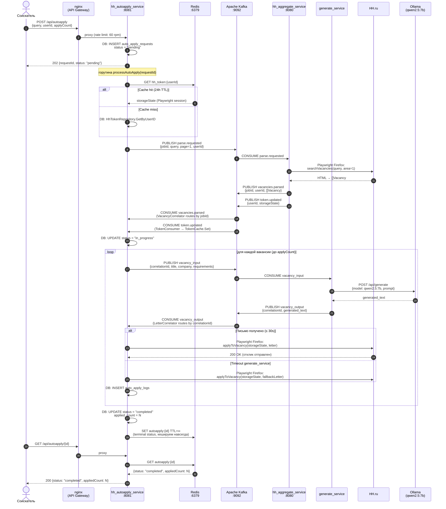

# C4 Dynamic — EDA AutoApply Flow

Полный флоу запроса автоотклика от POST до статуса `completed`.  
Показывает как контейнеры взаимодействуют через Kafka во времени.



## Таймауты

| Операция | Таймаут | Что происходит при превышении |
|---|---|---|
| WaitForJob (vacancies.parsed) | 2 мин | `processAutoApply` завершается с ошибкой |
| WaitForLetter (vacancy_output) | 30 сек | Используется fallback-письмо из захардкоженного списка |
| Playwright applyToVacancy | ~15 сек | Ошибка логируется, вакансия пропускается |

## Kafka correlation pattern

```
parse.requested  → jobId как key  → VacancyCorrelator.pending sync.Map[jobId → chan]
vacancy_input    → corrId как key → LetterCorrelator.pending  sync.Map[corrId → chan]
```
Каждый канал ждёт ровно одно сообщение, после чего закрывается. Race-free.
