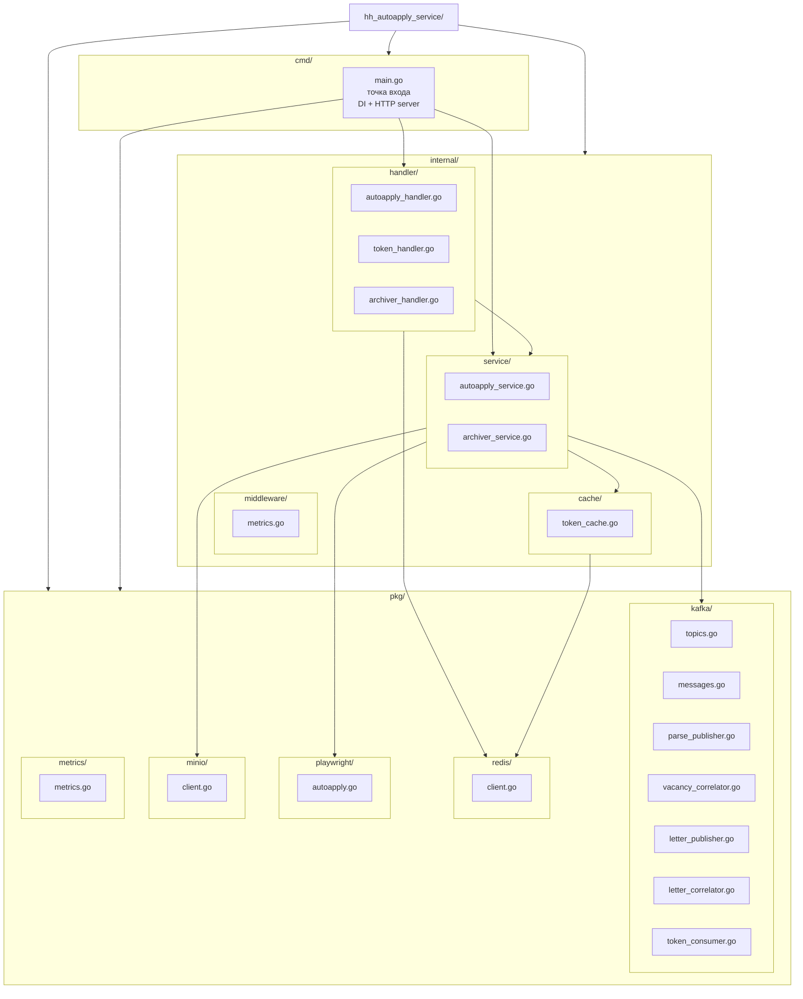
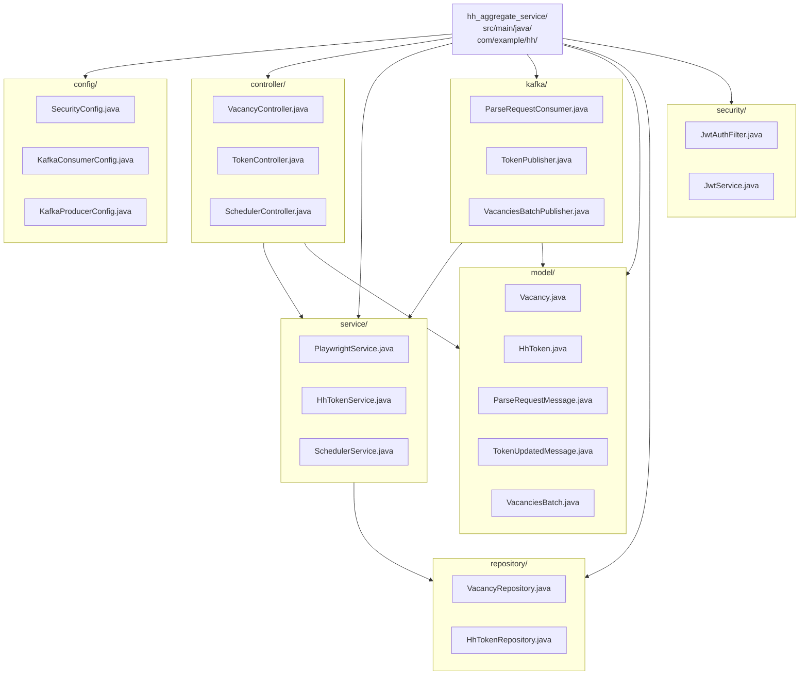
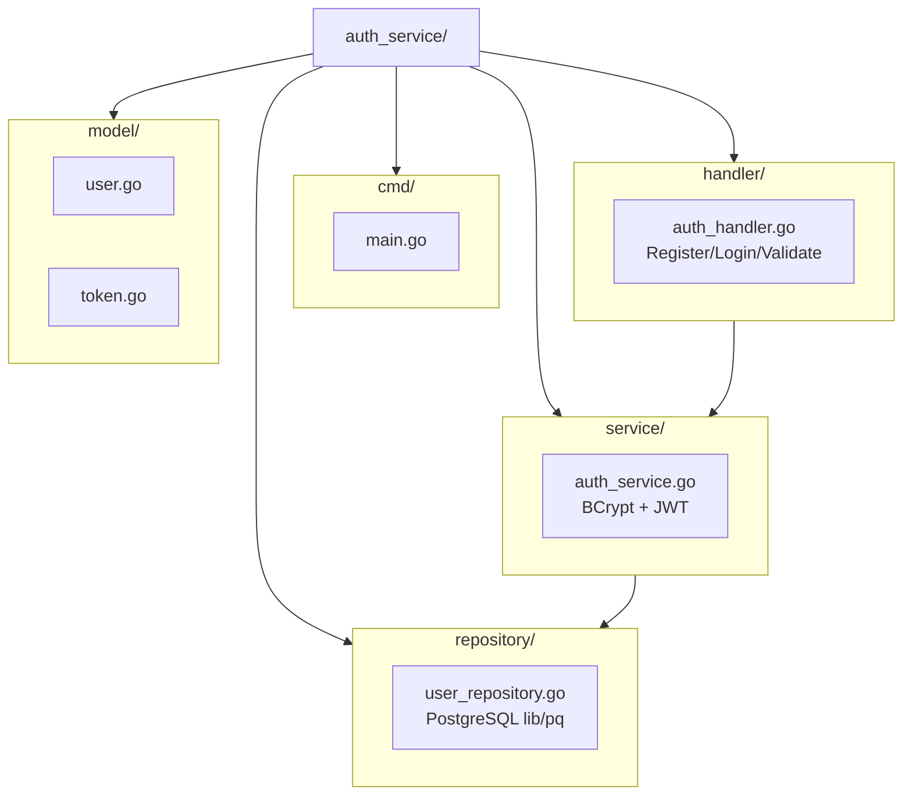
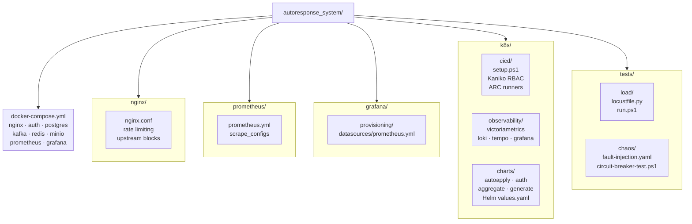

# Уровень 6 — Модули / Пакеты (Modules / Packages)

> Структура исходного кода: директории, файлы и их назначение.

## 6.1 hh_autoapply_service (Go)

## 6.2 hh_aggregate_service (Java / Maven)

## 6.3 auth_service (Go)

## 6.4 Инфраструктура проекта

