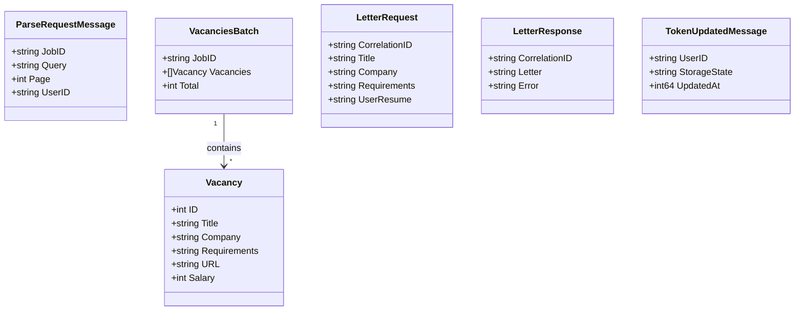
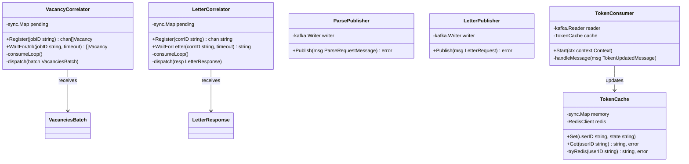
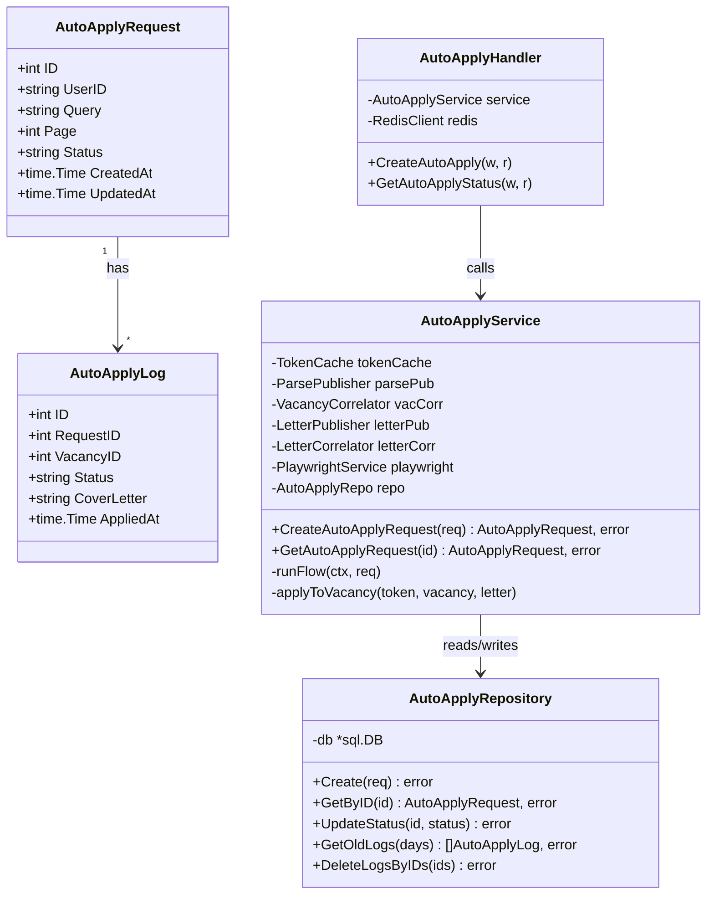
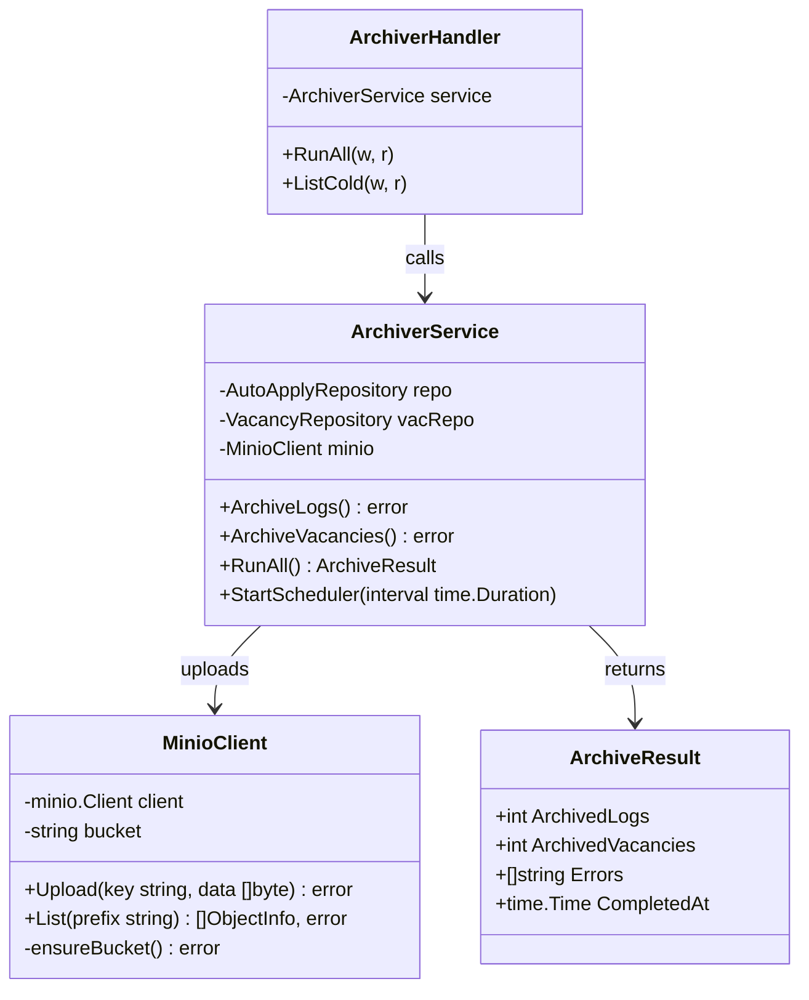
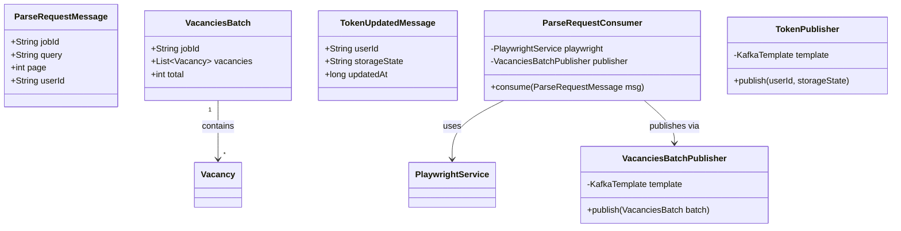

# Уровень 7 — Классы / Код (Classes / Code)

> UML-диаграммы ключевых структур данных и их отношений.
> Диаграммы разбиты по доменам для читаемости.

## 7.1 EDA — Kafka сообщения (Go)

## 7.2 Correlation ID паттерн (Go sync.Map)

## 7.3 AutoApply домен (Go)

## 7.4 Archiver (Go)

## 7.5 Kafka сообщения (Java)

