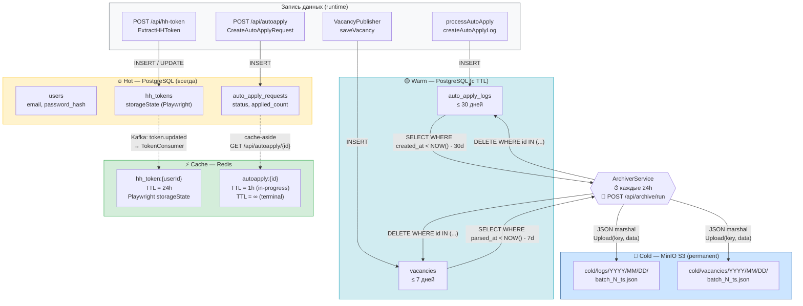

# C4 Dynamic — Data Tier Flow

Как данные движутся между тремя уровнями хранения: Hot → Warm → Cold.



## Таблица уровней

| Уровень | Хранилище | Таблицы / Пути | Срок жизни | Операции |
|---|---|---|---|---|
| **Hot** | PostgreSQL :5444 | `users`, `hh_tokens`, `auto_apply_requests` | Бессрочно | INSERT, SELECT, UPDATE |
| **Warm** | PostgreSQL :5444 | `auto_apply_logs`, `vacancies` | 30 / 7 дней | INSERT, SELECT, DELETE (ArchiverService) |
| **Cache** | Redis :6379 | `hh_token:{userId}`, `autoapply:{id}` | 24h / 1h / ∞ | GET, SET (TTL), DEL |
| **Cold** | MinIO :9000 | `cold/logs/…`, `cold/vacancies/…` | Постоянно | PUT (archive), GET (restore), LIST |

## Ключ архива в MinIO

```
cold/{type}/YYYY/MM/DD/batch_{count}_{unix_milli}.json
```

Пример: `cold/logs/2025/05/07/batch_142_1746619200000.json`

## Управление архивом

```bash
# Ручной запуск архивации
POST http://localhost/api/archive/run

# Список архивов
GET http://localhost/api/archive/list?prefix=logs
GET http://localhost/api/archive/list?prefix=vacancies

# MinIO Web Console
http://localhost:9001  (minioadmin / minioadmin)
```
